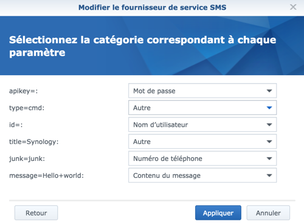

# Presentation

The Surveillance Station plug-in allows you to control Surveillance Station using the official Synology API.
And to display the live camera in a widget.

# Compatibility

- DSM 5 and later
- Surveillance Station version 8.0 minimum (Home Mode from version 8.1)

# Data visible on the Dashboard

- **Live** : to display the live camera (resizable widget with the pencil, see FAQ)
- **Enable or Disable** : Enable or disable a Surveillance Station camera (one or more cameras)
- **Show Status** : Displays the status of the camera (Off or On)
- **Start and stop a recording** : allows to force a recording (automatically store in Surveillance Station)
- **Snapshot** : Take a snapshot of the camera at the time of the request (automatically store in Surveillance Station)
- **Enable or Disable motion detection** : Enables or disables motion detection by scenario (by Surveillance Station or by Camera) ONLY when the camera is activated
- **PTZ** : to control the camera if it is compatible. "Patrol" and "Preset Position" are also available by scenario
- **Home Mode** : to display the status, to activate or deactivate the Home Mode by scenario (command attached to a camera, but it is a global activation / deactivation) )

# Scenario

The commands are available when creating a scenario. Here are some examples of uses:

- When activating / deactivating your alarm, it is possible to activate / deactivate automatically the Surveillance Station cameras and the Home Mode.
- During an intrusion detection, when the alarm is triggered. It is possible to create a scenario to force the recording. And / or take one or more snapshots.

# Installation / Configuration
## Installation
After installing the plugin via the Market. You arrive automatically on this page:

- Click on the "Activate" button

## Configuration
We will now configure the plugin.

- *DNS address of your Synolgy* : address / host DNS of your Synology NAS (DSM), and not the address of Surveillance Station (Examples of addresses: MySyno.tld, dsm.chezmoi.fr.). This same address must be accessible from outside (internet) and from your local network (LAN). In the case of using a LAN IP, the only feature that will not be possible from the outside: view the Live.
- *Port number* : Port number that is associated with your address (example: 443 for https)
- *Secure login* : Check if you use the https with a issued and verified certificate
- *Monitoring Station ID* : Identifier of an account with rights: "Monitoring" folder in "Permissions", "Surveillance Station" in "Applications" and a supervisory privilege in Surveillance Station
- *Password Surveillance Station* : password associated with your username

> **[IMPORTANT]**
>
> Secure login should be used only if your certificate has been issued and verified by a Certificate Authority. The plugin is not compatible with the default self-signed certificate.

Then, just go to the home page of the plugin configuration, and click on: Synchronization.

Once synchronization is complete, your cameras should appear in the "My Surveillance Station Cameras" area

Then define for each camera:

- Parent object
- Category (optional)
- Activate (Yes, otherwise the equipment will not be usable)
- Visible (optional if you do not want to make it visible on the Dashboard, but it will be usable in a scenario and visible in the panel)

# Tips
## Alert Jeedom of a detection from Surveillance Station
It is possible to set in Synology's Surveillance Station the call of an externet url (your Jeedom) in case of alert motion detection. To do so, you have to go to Surveillance Station, and add a rule of action.

Then enter the url of the command you want to launch in case of detection (example for a command with id 915 : http://dns_de_votre_jeedom/core/api/jeeApi.php?apikey=b8F......Hb7&type=cmd&id=915

## Alert Jeedom of activation and deactivation of Home Mode
It is possible to have Surveillance Station alert Jeedom when changing the Home Mode status, using the rule, in Surveillance Station.
And so, to make the two applications cohabit:

- to alert Jeedom in case of manual change made directly in Surveillance Station
- to alert Jeedom when enabling or disabling Home Mode by Geofence
- to order Jeedom's Surveillance Station

To begin, we will recover the 2 API URLs of Jeedom to launch the commands to activate / deactivate Home Mode. Simply :

- go to the configuration of one of your cameras
- go to the "Orders" tab
- click on the gear for the two commands "Active Home Mode" and "Disable Home Mode"
- Copy the "Direct URLs", and paste them into a notepad for example

We finished Jeedom. Note that you can also use a virtual to retrieve the information that will come from Surveillance Station

We will now configure Surveillance Station by adding two "Rule of Action".

Here is the explanation for the Jeedom "Active Home Mode" command (to be renewed for deactivation)

- launch "Rule of Action"
- click on add
- enter a name (for example: push activation Home Mode), do not modify the rest, and click on Next
- Event source, choose: Surveillance Station
- Event : select "Access Home Mode", then click on Next
- Action Device : choose "External Device"
- Url : paste the URL of the Jeedom "Active Home Mode" command, then click Next
- Programmer : personally, I leave Active everywhere since I use home automation or Geofense for management.

## Receive SMS from DSM / SS using Jeedom's SMS plugin
It is possible to configure DSM and SS to launch SMS notifications using Jeedom with the SMS plugin.
Just add Jeedom as an SMS service provider.

Before starting the config of DSM, we will prepare a URL:

- get the URL of the corresponding command: config plugin SMS, tab "Orders", click on the gear, and copy the direct URL
- You must set aside the following information that is contained in the URL: apikey and id

- in DSM (the configuration can be automatically taken over in SS)
- go to "Control Panel"
- then "Notification"
- tick "Enable SMS notifications"
- click on "Add SMS Service Provider"
- enter a name, example: Jeedom
- Paste the URL by modifying only the IP of your Jeedom: http://10.73.73.100/core/api/jeeApi.php?apikey=&type=cmd&id=&title=Synology&junk=junk&message=Hello+world
- click on next
- For apikey =: select Password
- For type = cmd =: let Other
- For id =: select User Name
- For title =: let other
- For junk = junk: select Phone number
- For message = Hello + world: select Message content
- and click Finish / Apply
- User name, enter the id of the command previously retrieved (id)
- Password, enter API key retrieved previously (apikey)
- Apply the changes, and click on "Send SMS test message"

# FAQ
### What is the frequency of refreshing the statutes?
The plugin updates the information every 5 minutes (modifiable in the "Task Engine")

### I do not see my predefined positions, and my patrols when creating a scenario:
as soon as you create a new position or patrol, you have to restart a synchronization via the plugin. Update the list in your scenarios.

### I get an error when I request the activation or deactivation of the camera or an error code 117:
the identifier certainly does not have the right privileges in Surveillance Station. Change viewer privilege to director

### I get an error code 105:
the ID does not have rights to use the Surveillance Station application (config panel / User / edit user / Application tab / Check Station check)

### I get a 401 error code:
the identifier is surely disabled in Surveillance Station. I advise you to use a unique identifier with rights: folder "monitoring" in "permissions", "Surveillance Station" in "Applications" and a privilege director in Surveillance Station

### I get a 407 error code:
login is blocked (config panel / Security / account tab / Allow / Block list / Blog list tab)

### I get an error: Connection refused
Make sure that the address and the port correspond to your Synology, and not to Surveillance Station

### The Live's poster is overflowing with the widget (or too big / small), I want to resize the size. How to do ?
You can resize the widget size with the pencil at the top right on the Dashboard.

### Resizing the Widget of my Live Camera does not work. What to do ?
Resizing is effective only after refreshing the page. For ease of adjustment, I advise you to choose a size of the Widget "camera off". And reactivate the camera, then refresh Dashboard again.

### In HTTPS, the live camera is not displayed. What to do ?
You certainly have a self-signed certificate (to check it, in DSM / Control Panel / Security / Certificate). In this case, the plugin is not compatible (it is possible to add an exception in your Internet browser, but this solution may not work on your mobile). I advise you to go through a certification authority. There are for example "StartSSL", "CAcert" and "Let's Encrypt" which offer a valid and free certificate (to be renewed once in a while according to the authority)

### Enabling and disabling the camera does not work. What to do ?
Check the user's privileges in Surveillance Station (probably as Spectator, to be changed to Director).

### Can not disable or enable motion detection. What to do ?
Activation or deactivation only works when the camera is activated. It is therefore necessary to activate the camera before modifying this parameter.

### Why do not I have the status of a recording in progress?
- I have not identified a return of info to recover a status of a recording in progress (or not) in the API (certainly passes to redo)
- I can especially do it if the action is done by Jeedom, but when is it if the recording was started by some other way ..
- even if a status was available in the doc, the latter would be updated only every 5min if the recording was launched by another means.

Basically, there is pros and cons to integration, and I made the decision not to post it. Because forcing I would have had a reverse request, a record was launched following a detection (to take this example), and I do not have the info in Jeedom. While I have the info when the action is done via Jeedom.

# Changelog
- 2018-03-22: Attention, you must re-save your equipment post update. Added possibility to hide the action and status bar
- 2018-03-07: Doc OK via Jeedom / Correction PTZ Home / Added info for SS incompatibility less than 8.0
- 2018-02: rewrite / redesign of the plugin
- 2017-09: removes info.xml
- 2017-05: adding the info plugin file in json
- 2016-11: addition of some PTZ commands (pending a redesign)
- 2016-10: adding advanced display
- 2.7: dependency fixes for Debian Wheezy
- 2.6: Compatibility correction with complex password (special characters). Automation of the installation of dependencies
- 2.5: addition activation or deactivation motion detection
- 2.4: Improved Resize Dashboard widget + Mobile widget fix
- 2.3: New logo (thanks Alois), redesign of the documentation and bug fix
- 2.2: Separation protocol http / https Internal / External network. Resizable live camera widget. New switches on the buttons enable / visible / log in the config
- 2.1: Fixed a bug with cameras that have an accented name.
- 2: Add feature: Live cameras, possibility to request a recording for x minutes, bug fixes
- 1.6: Added feature: Ability to specify a recording time. Added recording status in the cameras refresh list every 10 seconds on the equipment view.
- 1.5.1: Bug fixes, adding logs
- 1.5: Bug fixes: -Encoding of the mail (problem accents) -Problem preventing the test of the token dropbox -Problem when renaming a camera in dropbox -Problem display in the list of cameras
- 1.4: adding documentation
- 1.3: migration of the mail sending code, from Ruby to PHP + addition of historical status + ranking on the Dashboard
